# MARUNI Client 컴포넌트 다이어그램

> MARUNI 클라이언트의 전체 컴포넌트 구조를 Mermaid 다이어그램으로 시각화

**작성일**: 2025-11-10
**버전**: Phase 3 완료 기준

---

## 📐 1. 전체 아키텍처 (4계층)

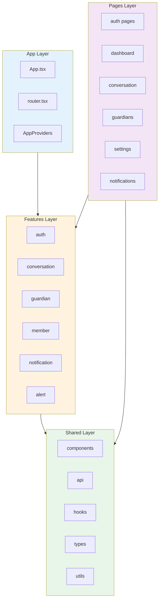

---

## 🧩 2. 애플리케이션 진입점

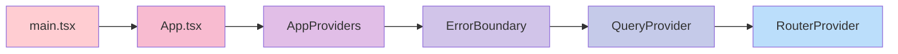

---

## 🎨 3. 페이지 렌더링 구조

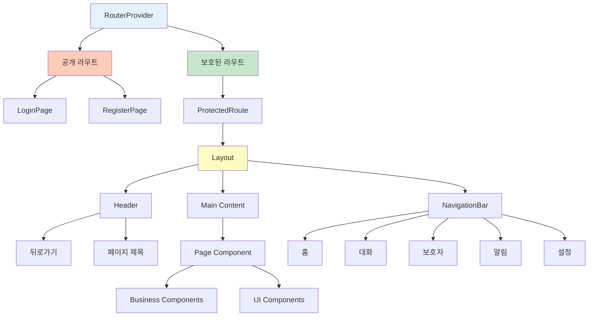

---

## 📦 4. Shared Components 구조

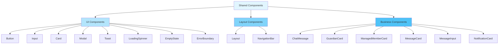

---

## 🔄 5. 데이터 흐름

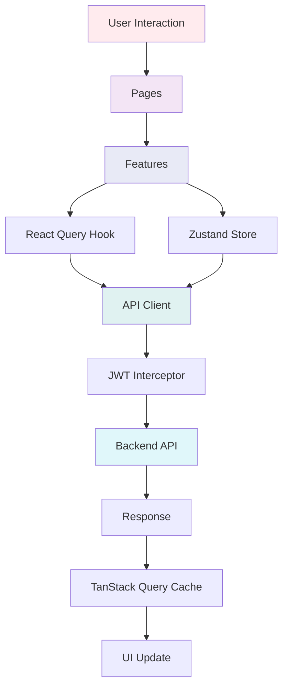

---

## 🗺️ 6. 라우팅 맵

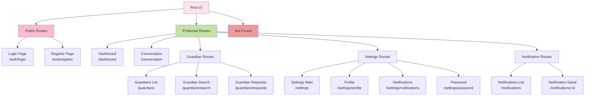

---

## 🏗️ 7. Feature 모듈 구조

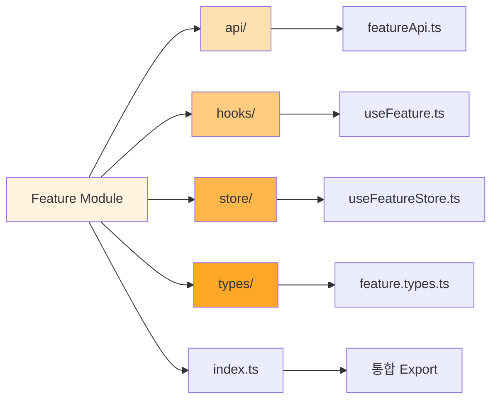

---

## 📊 8. Feature 목록

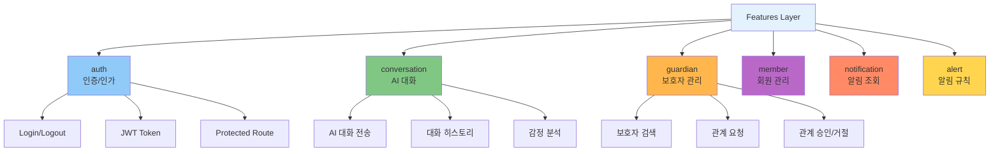

---

## 🔗 9. 의존성 관계

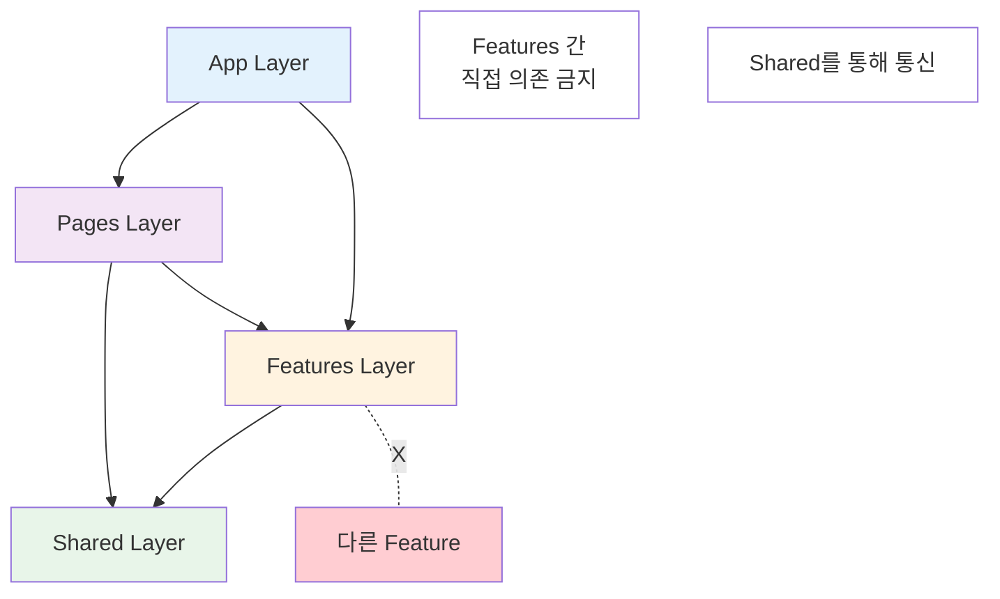

---

## 🎯 10. 컴포넌트 재사용 패턴

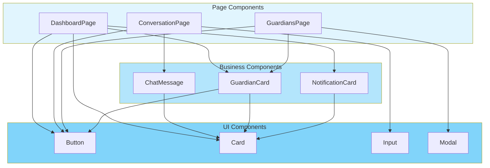

---

## 📱 11. 사용자 여정 플로우

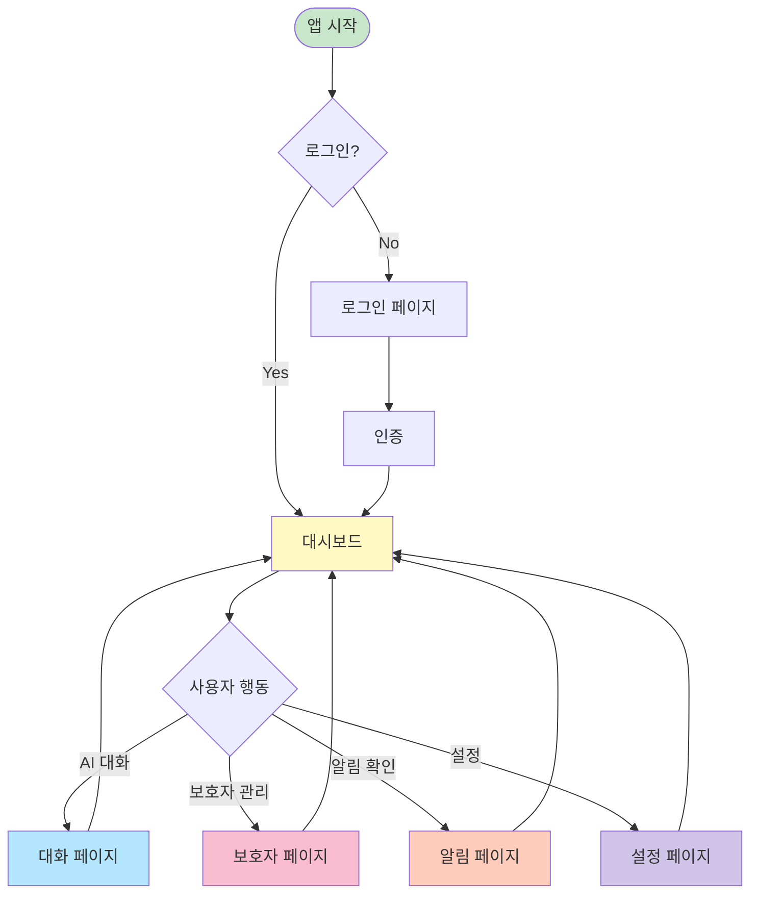

---

## 🛠️ 12. 개발 워크플로우

```mermaid
graph LR
    Dev[개발자]

    Dev -->|1| Feature[Feature 구현]
    Feature -->|2| Hook[Hook 작성]
    Hook -->|3| API[API 연결]
    API -->|4| Component[Component 생성]
    Component -->|5| Page[Page 조합]
    Page -->|6| Route[Route 추가]
    Route -->|7| Test[테스트]
    Test -->|8| Deploy[배포]

    style Dev fill:#ffebee
    style Feature fill:#f3e5f5
    style Hook fill:#ede7f6
    style API fill:#e8eaf6
    style Component fill:#e3f2fd
    style Page fill:#e1f5fe
    style Route fill:#e0f7fa
    style Test fill:#e0f2f1
    style Deploy fill:#c8e6c9
```

---

## 📈 사용 방법

이 문서는 다음 도구로 시각화할 수 있습니다:

1. **GitHub**: 마크다운에서 Mermaid 자동 렌더링
2. **VS Code**: Mermaid Preview 확장 설치
3. **Mermaid Live Editor**: https://mermaid.live
4. **Notion, Obsidian**: Mermaid 플러그인 지원

---

**📅 마지막 업데이트**: 2025-11-10
**📈 현재 상태**: Phase 3 완료 (API 연결 전)
