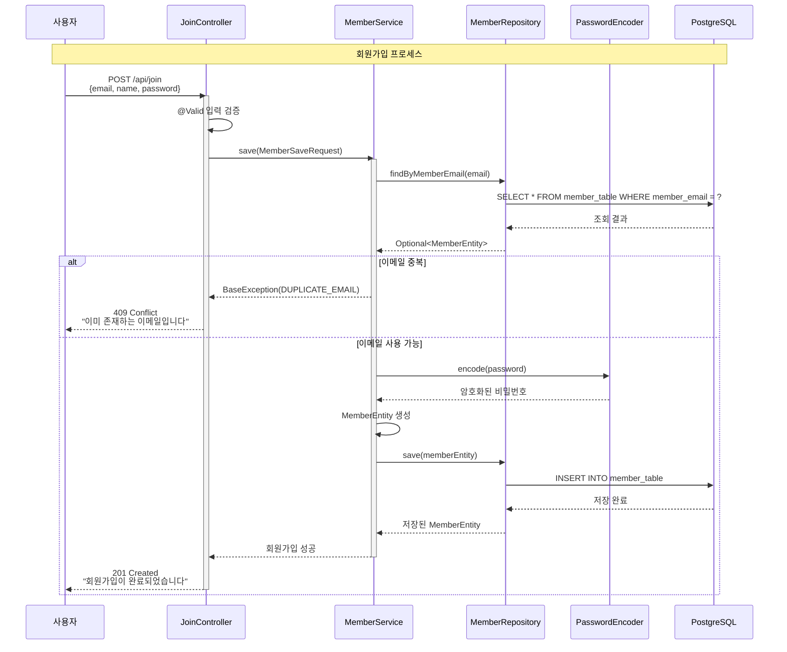
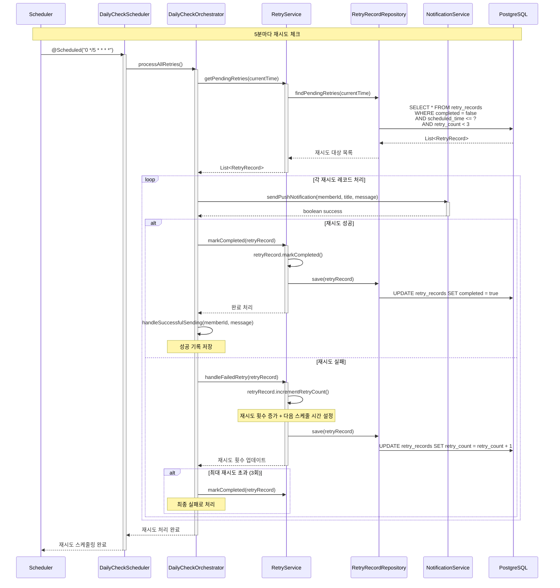
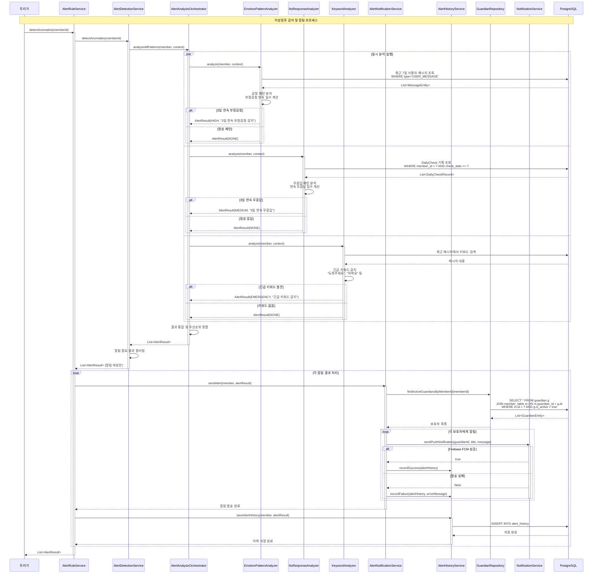
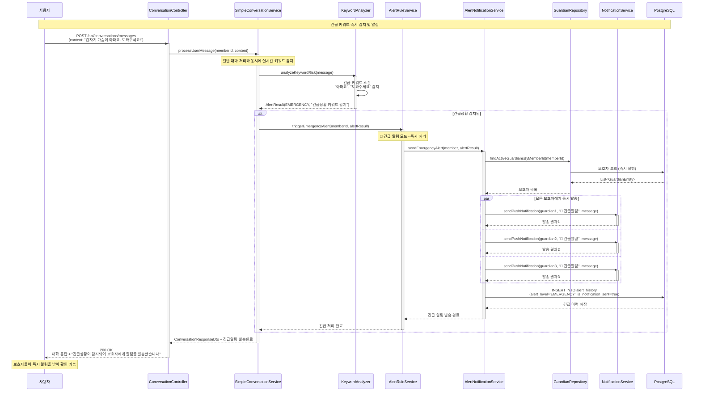
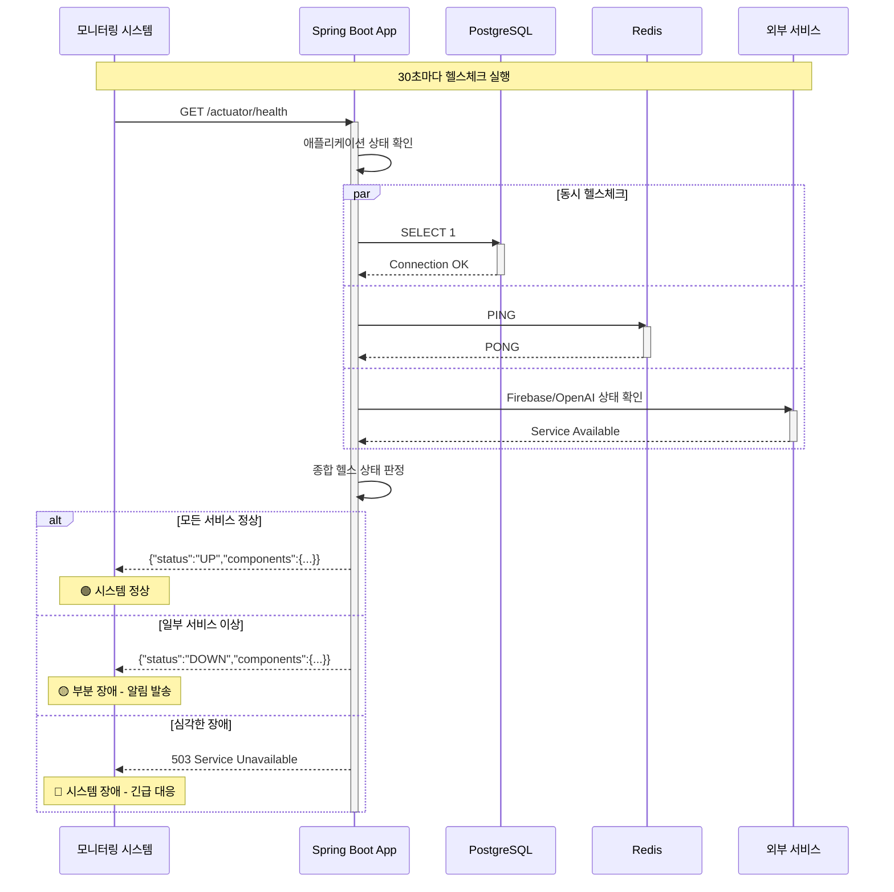

# MARUNI 프로젝트 시퀀스 다이어그램

**노인 돌봄을 위한 AI 기반 소통 서비스의 주요 비즈니스 플로우 상세 분석**

## 📋 문서 개요

이 문서는 MARUNI 프로젝트의 **핵심 비즈니스 플로우**를 시퀀스 다이어그램으로 시각화하여, 시스템 구성 요소 간의 상호작용과 시간 순서를 명확히 보여줍니다.

### 🎯 다이어그램 구성
- **인증 및 회원가입 플로우**: JWT 기반 보안 시스템
- **일일 안부 확인 플로우**: 자동화된 스케줄링 시스템
- **AI 대화 플로우**: OpenAI GPT-4o 기반 대화 시스템
- **이상징후 감지 플로우**: 3종 알고리즘 기반 감지 시스템
- **보호자 알림 플로우**: 실시간 알림 발송 시스템

---

## 🔐 인증 및 회원가입 플로우

### 👤 **1. 회원가입 시퀀스**



### 🔑 **2. 로그인 및 JWT 토큰 발급 시퀀스**

```mermaid
sequenceDiagram
    participant U as 사용자
    participant LF as LoginFilter
    participant UDS as CustomUserDetailsService
    participant MR as MemberRepository
    participant AEH as AuthenticationEventHandler
    participant TS as JwtTokenService
    participant JU as JWTUtil
    participant Redis as Redis
    participant DB as PostgreSQL

    Note over U, Redis: JWT 기반 로그인 프로세스

    U->>LF: POST /api/members/login<br/>{email, password}
    activate LF

    LF->>UDS: loadUserByUsername(email)
    activate UDS
    UDS->>MR: findByMemberEmail(email)
    MR->>DB: SELECT * FROM member_table WHERE member_email = ?
    DB-->>MR: MemberEntity
    MR-->>UDS: MemberEntity
    UDS->>UDS: new CustomUserDetails(member)
    UDS-->>LF: UserDetails
    deactivate UDS

    LF->>LF: authenticate(email, password)

    alt 인증 성공
        LF->>AEH: handleLoginSuccess(response, memberInfo)
        activate AEH
        AEH->>TS: issueTokens(response, memberInfo)
        activate TS

        TS->>JU: createAccessToken(memberId, email)
        JU-->>TS: Access Token (1시간)

        TS->>JU: createRefreshToken(memberId, email)
        JU-->>TS: Refresh Token (24시간)

        TS->>Redis: SET refreshToken:{memberId} {token} EX 86400
        Redis-->>TS: OK

        TS->>TS: setAccessToken(response, accessToken)
        Note over TS: Authorization: Bearer {accessToken}

        TS->>TS: setRefreshCookie(response, refreshToken)
        Note over TS: HttpOnly Cookie 설정

        TS-->>AEH: 토큰 발급 완료
        deactivate TS
        AEH-->>LF: 인증 완료
        deactivate AEH

        LF-->>U: 200 OK<br/>Authorization 헤더 + HttpOnly 쿠키
        deactivate LF

    else 인증 실패
        LF-->>U: 401 Unauthorized<br/>"이메일 또는 비밀번호가 잘못되었습니다"
        deactivate LF
    end
```

### 🔄 **3. Access Token 재발급 시퀀스**

```mermaid
sequenceDiagram
    participant U as 사용자
    participant AC as AuthController
    participant AS as AuthenticationService
    participant TV as TokenValidator
    parameter TM as TokenManager
    participant RTS as RefreshTokenService
    participant TS as TokenService
    participant Redis as Redis

    Note over U, Redis: Access Token 재발급 프로세스

    U->>AC: POST /api/auth/token/refresh<br/>Cookie: refresh={token}
    activate AC

    AC->>AS: refreshAccessToken(request, response)
    activate AS

    AS->>TM: extractRefreshToken(request)
    TM-->>AS: Refresh Token

    AS->>TV: validateRefreshToken(refreshToken)
    activate TV

    TV->>TM: isRefreshToken(refreshToken)
    TM-->>TV: true (JWT 검증 통과)

    TV->>TM: getId(refreshToken)
    TM-->>TV: memberId

    TV->>RTS: isValidTokenForMember(memberId, refreshToken)
    RTS->>Redis: GET refreshToken:{memberId}
    Redis-->>RTS: 저장된 토큰
    RTS-->>TV: true (토큰 일치)

    TV->>TM: getEmail(refreshToken)
    TM-->>TV: email

    TV-->>AS: TokenValidationResult.valid(memberId, email)
    deactivate TV

    AS->>TS: reissueAccessToken(response, memberId, email)
    activate TS
    TS->>TM: createAccessToken(memberId, email)
    TM-->>TS: 새로운 Access Token
    TS->>TS: setAccessToken(response, accessToken)
    TS-->>AS: 재발급 완료
    deactivate TS

    AS-->>AC: TokenResponse
    deactivate AS

    AC-->>U: 200 OK<br/>새로운 Authorization 헤더
    deactivate AC
```

---

## 📅 일일 안부 확인 플로우

### ⏰ **4. 매일 정시 안부 메시지 발송 시퀀스**

```mermaid
sequenceDiagram
    participant S as Scheduler
    participant DCS as DailyCheckScheduler
    participant DCO as DailyCheckOrchestrator
    participant MR as MemberRepository
    parameter NS as NotificationService
    participant CS as ConversationService
    participant DCRR as DailyCheckRecordRepository
    participant RS as RetryService
    participant DB as PostgreSQL

    Note over S, DB: 매일 오전 9시 자동 실행

    S->>DCS: @Scheduled("0 0 9 * * *")
    activate DCS
    DCS->>DCO: processAllActiveMembers()
    activate DCO

    DCO->>MR: findActiveMemberIds()
    MR->>DB: SELECT id FROM member_table
    DB-->>MR: List<Long> memberIds
    MR-->>DCO: 활성 회원 목록

    loop 각 회원별 처리
        DCO->>DCO: processMemberDailyCheck(memberId)

        DCO->>DCRR: existsSuccessfulRecordByMemberIdAndDate(memberId, today)
        DCRR->>DB: SELECT COUNT(*) FROM daily_check_records<br/>WHERE member_id = ? AND check_date = ? AND success = true
        DB-->>DCRR: 중복 체크 결과
        DCRR-->>DCO: boolean

        alt 이미 발송됨
            Note over DCO: 중복 발송 방지 - SKIP
        else 발송 필요
            DCO->>DCO: isAllowedSendingTime(현재시간)
            Note over DCO: 7시-21시 체크

            alt 발송 가능 시간
                DCO->>NS: sendPushNotification(memberId, title, message)
                activate NS
                NS-->>DCO: boolean success
                deactivate NS

                alt 발송 성공
                    DCO->>CS: processSystemMessage(memberId, message)
                    Note over CS: 시스템 메시지로 대화 기록

                    DCO->>DCO: saveDailyCheckRecord(memberId, message, true)
                    DCO->>DCRR: save(successRecord)
                    DCRR->>DB: INSERT INTO daily_check_records

                else 발송 실패
                    DCO->>DCO: saveDailyCheckRecord(memberId, message, false)
                    DCO->>RS: scheduleRetry(memberId, message)
                    Note over RS: 5분 후 재시도 스케줄링
                end

            else 발송 불가 시간
                Note over DCO: 시간 제한으로 발송 생략
            end
        end
    end

    DCO-->>DCS: 전체 처리 완료
    deactivate DCO
    DCS-->>S: 스케줄링 완료
    deactivate DCS
```

### 🔄 **5. 자동 재시도 시스템 시퀀스**



---

## 💬 AI 대화 시스템 플로우

### 🤖 **6. OpenAI GPT-4o 기반 대화 시스템 시퀀스**

```mermaid
sequenceDiagram
    participant U as 사용자
    participant CC as ConversationController
    participant SCS as SimpleConversationService
    participant CM as ConversationManager
    participant MP as MessageProcessor
    participant CR as ConversationRepository
    participant MR as MessageRepository
    participant EAP as EmotionAnalysisPort
    parameter ARP as AIResponsePort
    participant OpenAI as OpenAI GPT-4o
    participant DB as PostgreSQL

    Note over U, DB: AI 대화 처리 프로세스

    U->>CC: POST /api/conversations/messages<br/>{content: "오늘 기분이 좋아요!"}
    activate CC

    CC->>SCS: processUserMessage(memberId, content)
    activate SCS

    SCS->>CM: findOrCreateActive(memberId)
    activate CM
    CM->>CR: findTopByMemberIdOrderByCreatedAtDesc(memberId)
    CR->>DB: SELECT * FROM conversations<br/>WHERE member_id = ? ORDER BY created_at DESC LIMIT 1
    DB-->>CR: ConversationEntity (또는 null)
    CR-->>CM: Optional<ConversationEntity>

    alt 기존 대화 존재
        Note over CM: 기존 대화 세션 사용
    else 새 대화 필요
        CM->>CM: createNewConversation(memberId)
        CM->>CR: save(newConversation)
        CR->>DB: INSERT INTO conversations
        DB-->>CR: 저장된 ConversationEntity
    end

    CM-->>SCS: ConversationEntity
    deactivate CM

    SCS->>MP: processMessage(conversation, content)
    activate MP

    MP->>EAP: analyzeEmotion(content)
    activate EAP
    EAP->>EAP: 키워드 기반 감정 분석<br/>"좋", "기분" → POSITIVE
    EAP-->>MP: EmotionType.POSITIVE
    deactivate EAP

    MP->>MP: 대화 컨텍스트 구성
    Note over MP: MemberProfile + 최근 히스토리 + 현재 감정

    MP->>MP: conversation.addUserMessage(content, emotion)
    MP->>MR: save(userMessage)
    MR->>DB: INSERT INTO messages (type='USER_MESSAGE')
    DB-->>MR: 저장된 MessageEntity

    MP->>ARP: generateResponse(conversationContext)
    activate ARP
    ARP->>ARP: buildPromptWithContext(context)
    Note over ARP: 노인 돌봄 특화 프롬프트 + 사용자 프로필 + 대화 히스토리

    ARP->>OpenAI: Chat Completion API<br/>GPT-4o 모델 호출
    activate OpenAI
    OpenAI-->>ARP: "기분이 좋으시다니 정말 다행이에요!<br/>오늘은 어떤 좋은 일이 있으셨나요?"
    deactivate OpenAI

    ARP->>ARP: truncateResponse(response)
    Note over ARP: 100자 제한 적용
    ARP-->>MP: AI 응답 텍스트
    deactivate ARP

    MP->>MP: conversation.addAIMessage(aiResponse)
    MP->>MR: save(aiMessage)
    MR->>DB: INSERT INTO messages (type='AI_RESPONSE')
    DB-->>MR: 저장된 MessageEntity

    MP-->>SCS: MessageExchangeResult
    deactivate MP

    SCS->>SCS: mapper.toResponseDto(result)
    SCS-->>CC: ConversationResponseDto
    deactivate SCS

    CC-->>U: 200 OK<br/>{conversationId, userMessage, aiMessage}
    deactivate CC
```

---

## 🚨 이상징후 감지 시스템 플로우

### 🔍 **7. 3종 알고리즘 기반 이상징후 감지 시퀀스**



### 🔴 **8. 긴급상황 즉시 알림 시퀀스**



---

## 🔔 보호자 알림 시스템 플로우

### 📱 **9. Firebase FCM 기반 푸시 알림 시퀀스**

```mermaid
sequenceDiagram
    participant Trigger as 알림 트리거
    participant NS as NotificationService<br/>(3중 안전망)
    participant RNS as RetryableNotificationService
    participant NHD as NotificationHistoryDecorator
    participant FNS as FallbackNotificationService
    participant FPNS as FirebasePushNotificationService
    participant MPNS as MockPushNotificationService
    participant PTS as PushTokenService
    participant FMW as FirebaseMessagingWrapper
    participant NHS as NotificationHistoryService
    participant Firebase as Firebase FCM
    participant Redis as Redis
    participant DB as PostgreSQL

    Note over Trigger, DB: 3중 안전망 푸시 알림 시스템

    Trigger->>NS: sendPushNotification(memberId, title, message)
    activate NS
    Note over NS: 최상위 래퍼 (안정성 강화 서비스)

    NS->>RNS: sendPushNotificationWithRetry(...)
    activate RNS
    Note over RNS: 재시도 기능 (최대 3회)

    RNS->>NHD: sendPushNotification(...)
    activate NHD
    Note over NHD: 이력 자동 저장

    NHD->>FNS: sendPushNotification(...)
    activate FNS
    Note over FNS: Fallback 시스템

    FNS->>FPNS: sendPushNotification(...) [Primary 시도]
    activate FPNS

    FPNS->>PTS: getPushTokenByMemberId(memberId)
    activate PTS
    PTS->>DB: 회원 푸시 토큰 조회
    DB-->>PTS: pushToken
    PTS-->>FPNS: pushToken
    deactivate PTS

    FPNS->>FMW: sendMessage(firebaseMessage)
    activate FMW
    FMW->>Firebase: HTTP POST /v1/projects/maruni/messages:send
    activate Firebase

    alt Firebase 발송 성공
        Firebase-->>FMW: {name: "projects/maruni/messages/abc123"}
        FMW-->>FPNS: messageId
        deactivate FMW
        FPNS-->>FNS: true (성공)
        deactivate FPNS
        FNS-->>NHD: true (Primary 성공)
        deactivate FNS

        NHD->>NHS: recordSuccess(memberId, title, message, PUSH)
        activate NHS
        NHS->>DB: INSERT INTO notification_history<br/>(success=true, channel_type='PUSH')
        NHS-->>NHD: 성공 이력 저장
        deactivate NHS

        NHD-->>RNS: true
        deactivate NHD
        RNS-->>NS: true (1회만에 성공)
        deactivate RNS

    else Firebase 발송 실패
        Firebase-->>FMW: 500 Internal Server Error
        deactivate Firebase
        FMW-->>FPNS: FirebaseMessagingException
        deactivate FMW
        FPNS-->>FNS: Exception 발생
        deactivate FPNS

        Note over FNS: 🔄 Fallback 모드 전환

        FNS->>MPNS: sendPushNotification(...) [Fallback 시도]
        activate MPNS
        MPNS->>MPNS: Mock 알림 처리<br/>(개발환경 또는 백업)
        MPNS-->>FNS: true (Mock 성공)
        deactivate MPNS

        FNS-->>NHD: true (Fallback 성공)
        deactivate FNS

        NHD->>NHS: recordSuccess(memberId, title, message, PUSH)
        activate NHS
        NHS->>DB: INSERT INTO notification_history<br/>(success=true, channel_type='PUSH', error_message='Fallback 사용')
        NHS-->>NHD: Fallback 성공 이력 저장
        deactivate NHS

        NHD-->>RNS: true
        deactivate NHD
        RNS-->>NS: true (Fallback으로 성공)
        deactivate RNS

    else 모든 시도 실패
        Note over FNS: Primary + Fallback 모두 실패

        FNS-->>NHD: false
        deactivate FNS

        NHD->>NHS: recordFailure(memberId, title, message, PUSH, "모든 서비스 실패")
        activate NHS
        NHS->>DB: INSERT INTO notification_history<br/>(success=false, error_message='모든 서비스 실패')
        NHS-->>NHD: 실패 이력 저장
        deactivate NHS

        NHD-->>RNS: false
        deactivate NHD

        Note over RNS: 🔄 재시도 로직 실행 (최대 3회)

        alt 재시도 횟수 < 3
            RNS->>RNS: 지수 백오프 대기<br/>(1초 → 2초 → 4초)
            Note over RNS: 재시도 시도...
        else 최대 재시도 초과
            RNS-->>NS: false (모든 시도 실패)
            deactivate RNS
        end
    end

    NS-->>Trigger: boolean result
    deactivate NS

    Note over Trigger: 결과에 따른 후속 처리<br/>성공: 정상 진행<br/>실패: 관리자 알림 또는 대안 방법
```

---

## 📊 성능 최적화 및 모니터링

### ⚡ **10. 데이터베이스 최적화 및 캐싱 시퀀스**

```mermaid
sequenceDiagram
    participant API as API Request
    participant Service as Application Service
    participant Cache as Redis Cache
    participant DB as PostgreSQL
    participant Index as DB Index

    Note over API, Index: 성능 최적화된 데이터 접근

    API->>Service: 데이터 조회 요청
    activate Service

    Service->>Cache: GET cache:key
    activate Cache

    alt 캐시 HIT
        Cache-->>Service: 캐시된 데이터
        deactivate Cache
        Service-->>API: 즉시 응답 (< 10ms)
        deactivate Service

    else 캐시 MISS
        Cache-->>Service: null
        deactivate Cache

        Service->>DB: 최적화된 쿼리 실행
        activate DB

        DB->>Index: 인덱스 활용<br/>(복합 인덱스: member_id + created_at)
        activate Index
        Index-->>DB: 빠른 데이터 스캔
        deactivate Index

        DB-->>Service: 쿼리 결과 (< 100ms)
        deactivate DB

        Service->>Cache: SET cache:key value EX 300
        activate Cache
        Cache-->>Service: 캐시 저장 완료
        deactivate Cache

        Service-->>API: 데이터 응답
        deactivate Service
    end

    Note over API: 성능 목표:<br/>캐시 HIT: < 10ms<br/>캐시 MISS: < 100ms
```

### 📈 **11. 헬스체크 및 모니터링 시퀀스**



---

## 🎯 확장 가능성 및 미래 계획

### 🚀 **12. Phase 3 확장 - 마이크로서비스 분리 시퀀스**

```mermaid
sequenceDiagram
    participant Client as 클라이언트
    participant Gateway as API Gateway
    participant Auth as Auth Service
    participant User as User Service
    participant Chat as Chat Service
    participant Alert as Alert Service
    participant Queue as Message Queue
    participant Config as Config Server

    Note over Client, Config: 마이크로서비스 아키텍처 확장

    Client->>Gateway: API 요청
    activate Gateway

    Gateway->>Config: 라우팅 설정 조회
    Config-->>Gateway: 서비스 라우팅 정보

    Gateway->>Auth: 토큰 검증
    activate Auth
    Auth-->>Gateway: 인증 결과
    deactivate Auth

    alt 인증 성공
        Gateway->>User: 사용자 정보 조회
        activate User
        User-->>Gateway: 사용자 데이터
        deactivate User

        Gateway->>Chat: AI 대화 요청
        activate Chat
        Chat->>Queue: 비동기 메시지 발행
        activate Queue
        Queue-->>Alert: 이상징후 감지 이벤트
        activate Alert
        Alert-->>Queue: 처리 완료
        deactivate Alert
        Queue-->>Chat: 이벤트 처리 완료
        deactivate Queue
        Chat-->>Gateway: 대화 응답
        deactivate Chat

        Gateway-->>Client: 통합 응답
        deactivate Gateway

    else 인증 실패
        Gateway-->>Client: 401 Unauthorized
        deactivate Gateway
    end
```

---

## 📋 문서 연관 관계

### 🔗 **관련 문서**
- **[유저 플로우 다이어그램](./user_flow_diagram.md)**: 전체 사용자 여정 및 비즈니스 플로우
- **[컨테이너 다이어그램](./container_diagram.md)**: 시스템 아키텍처 및 배포 구조
- **[전체 프로젝트 가이드](./README.md)**: 프로젝트 개요 및 현황
- **[도메인 구조](./domains/README.md)**: 비즈니스 도메인 아키텍처

### 🛠️ **기술 문서**
- **[API 설계 가이드](./specifications/api-design-guide.md)**: REST API 설계 패턴
- **[보안 가이드](./specifications/security-guide.md)**: JWT 보안 구현
- **[아키텍처 가이드](./specifications/architecture-guide.md)**: DDD 구조 설계
- **[테스트 가이드](./specifications/testing-guide.md)**: TDD 방법론

---

**MARUNI 시퀀스 다이어그램은 노인 돌봄 서비스의 모든 핵심 플로우를 시간 순서대로 상세히 보여줍니다. 각 컴포넌트 간의 상호작용을 통해 시스템의 동작 원리를 명확히 이해할 수 있으며, 향후 시스템 확장 및 최적화를 위한 기반 자료로 활용됩니다.** 🚀