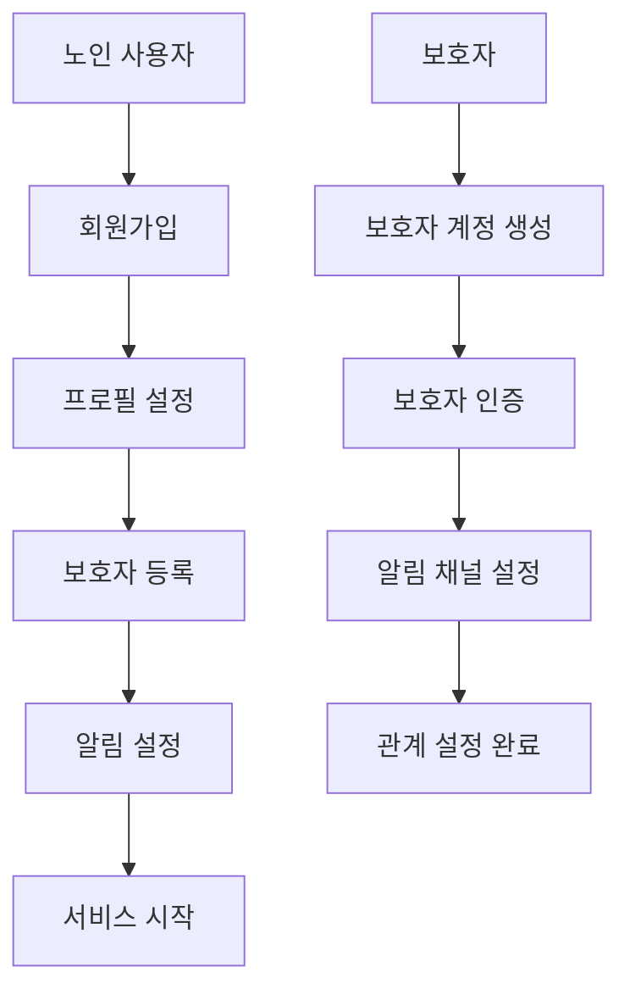
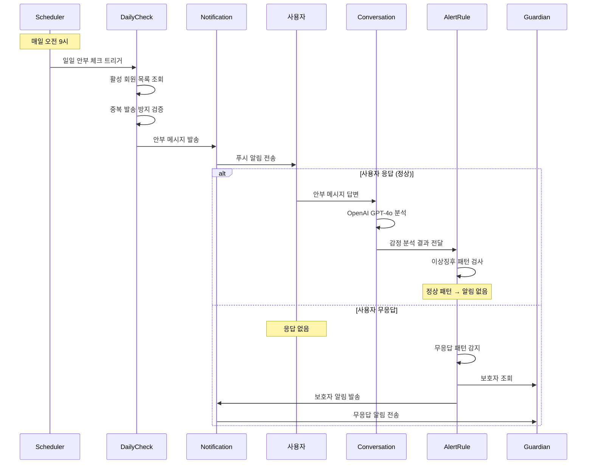
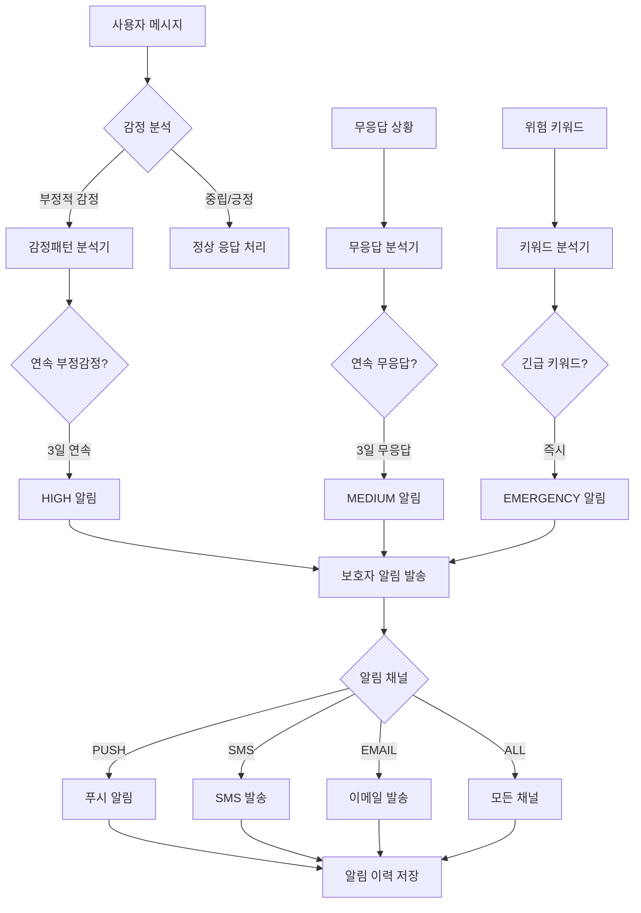
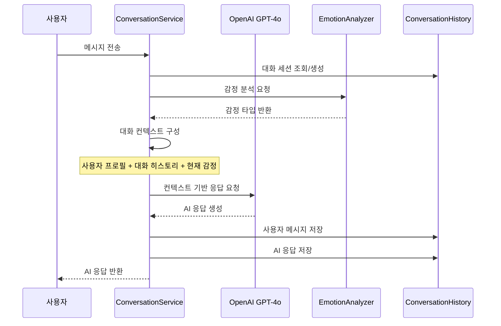
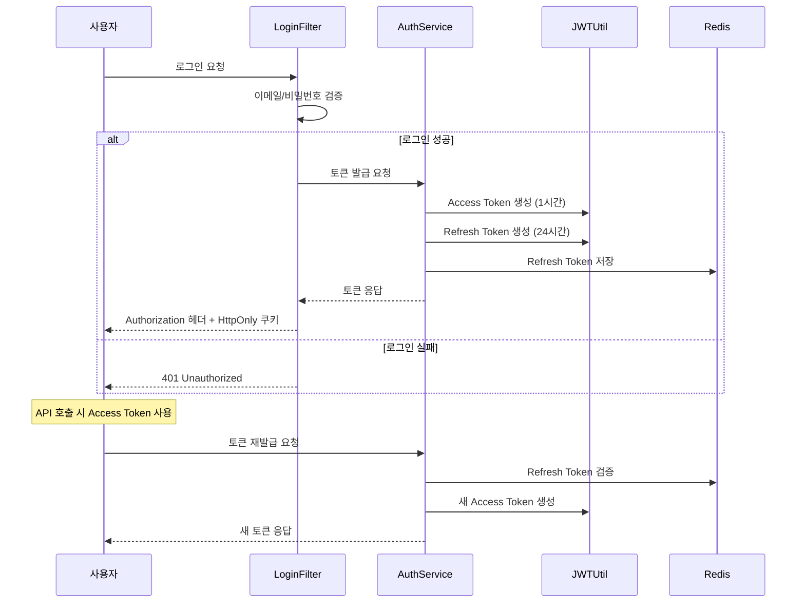
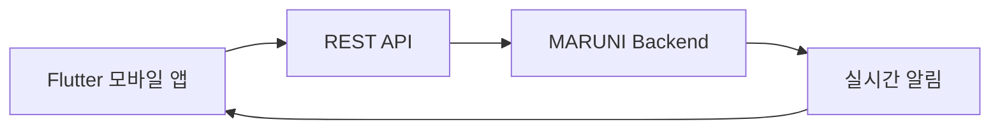
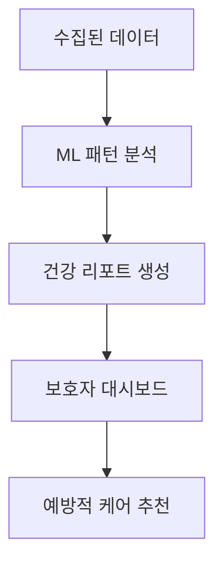

# MARUNI 프로젝트 유저 흐름도

**노인 돌봄을 위한 AI 기반 소통 서비스의 완전한 사용자 흐름 가이드**

## 📋 문서 개요

**MARUNI**는 매일 안부 확인 → AI 분석 → 이상징후 감지 → 보호자 알림의 완전 자동화된 노인 돌봄 플랫폼입니다.

### 🎯 핵심 서비스 플로우
```
매일 오전 9시 안부 메시지 자동 발송
         ↓
사용자 응답 → AI 분석 (OpenAI GPT-4o)
         ↓
이상징후 감지 (3종 알고리즘)
         ↓
보호자 알림 발송 (실시간)
```

---

## 🧑‍🦳 주요 사용자 그룹

### 1. **노인 사용자 (Primary User)**
- **연령대**: 60세 이상 어르신
- **기술 수준**: 스마트폰 기본 사용 가능
- **주요 니즈**: 외로움 해소, 일상 소통, 건강 관리

### 2. **보호자 (Guardian)**
- **관계**: 가족, 친구, 돌봄제공자, 이웃
- **기술 수준**: 중급 이상
- **주요 니즈**: 실시간 안부 확인, 이상 상황 알림

### 3. **관리자 (System Admin)**
- **역할**: 시스템 모니터링, 사용자 관리
- **접근 권한**: 전체 시스템 관리

---

## 🔄 전체 서비스 플로우

### 📱 **Phase 1: 회원가입 및 초기 설정**



#### 📋 상세 플로우

1. **노인 사용자 회원가입**
   - 이메일 중복 확인
   - 비밀번호 설정 (BCrypt 암호화)
   - 기본 프로필 정보 입력

2. **보호자 등록**
   - 보호자 정보 입력 (이름, 연락처, 관계)
   - 알림 채널 설정 (푸시/SMS/이메일/전체)
   - 보호자-사용자 관계 매핑

3. **초기 설정 완료**
   - JWT 토큰 발급
   - 푸시 토큰 등록
   - 서비스 이용 시작

---

### 📅 **Phase 2: 일일 안부 확인 자동화**



#### 📋 상세 플로우

1. **자동 스케줄링 (매일 오전 9시)**
   ```yaml
   cron: "0 0 9 * * *"  # 매일 오전 9시
   ```

2. **안부 메시지 발송**
   - 활성 회원 목록 조회
   - 중복 발송 방지 (DB 제약 조건)
   - Firebase FCM 푸시 알림 발송
   - 발송 기록 저장

3. **사용자 응답 처리**
   - 대화 세션 자동 생성/조회
   - OpenAI GPT-4o 기반 AI 응답
   - 감정 분석 (키워드 기반)
   - 대화 기록 영속화

4. **자동 재시도 시스템**
   - 발송 실패 시 5분 간격 재시도
   - 최대 3회 재시도
   - 점진적 지연 (Exponential Backoff)

---

### 🚨 **Phase 3: 이상징후 감지 및 보호자 알림**



#### 📋 3종 이상징후 감지 알고리즘

1. **감정패턴 분석기 (EmotionPatternAnalyzer)**
   ```java
   // 부정적 키워드 패턴
   negative: ["슬프", "우울", "아프", "힘들", "외로", "무서", "걱정", "답답"]

   // 분석 로직
   - 최근 7일간 사용자 메시지 감정 분석
   - 연속 부정감정 일수 계산
   - 3일 연속 부정감정 → HIGH 레벨 알림
   ```

2. **무응답 분석기 (NoResponseAnalyzer)**
   ```java
   // DailyCheck 기록 기반 분석
   - 최근 7일간 안부 메시지 응답률 확인
   - 연속 무응답 일수 계산
   - 3일 연속 무응답 → MEDIUM 레벨 알림
   ```

3. **키워드 분석기 (KeywordAnalyzer)**
   ```java
   // 긴급 키워드 즉시 감지
   emergency: ["도와주세요", "응급실", "119", "아파요", "쓰러졌어요"]

   // 즉시 알림 발송 → EMERGENCY 레벨
   ```

#### 📋 알림 레벨 및 대응

| 레벨 | 우선순위 | 상황 | 대응 방식 |
|------|----------|------|-----------|
| **EMERGENCY** | 4 | 긴급 키워드 감지 | 즉시 모든 채널 알림 |
| **HIGH** | 3 | 3일 연속 부정감정 | 빠른 확인 요청 |
| **MEDIUM** | 2 | 3일 연속 무응답 | 주의 관찰 요청 |
| **LOW** | 1 | 정보성 패턴 | 참고용 알림 |

---

### 💬 **Phase 4: AI 대화 시스템 (OpenAI GPT-4o)**



#### 📋 멀티턴 대화 지원

1. **대화 컨텍스트 구성**
   ```java
   ConversationContext {
       String currentMessage;           // 현재 사용자 메시지
       List<MessageEntity> recentHistory; // 최근 5턴 대화 히스토리
       MemberProfile memberProfile;     // 사용자 프로필 (연령대, 성격)
       EmotionType currentEmotion;      // 현재 감정 상태
   }
   ```

2. **개인화된 AI 응답**
   ```java
   // 노인 돌봄 특화 시스템 프롬프트
   "당신은 노인 돌봄 전문 AI 상담사입니다.
   70대 어르신과 따뜻하고 공감적으로 대화하며,
   이전 대화 내용을 기억하여 연속성 있는 대화를 제공하세요."
   ```

3. **응답 예시**
   - **일반적 응답**: "안녕하세요! 오늘 하루는 어떻게 지내고 계신가요?"
   - **개인화 응답**: "70대이신 어르신이 기분이 좋으시다니 정말 다행이에요! 지난번에 말씀하신 산책도 도움이 되셨나요?"

---

### 🔐 **Phase 5: 인증 및 보안 시스템**



#### 📋 JWT 이중 토큰 시스템

1. **Access Token**
   - **수명**: 1시간
   - **저장**: Authorization 헤더
   - **용도**: API 인증

2. **Refresh Token**
   - **수명**: 24시간
   - **저장**: HttpOnly 쿠키 + Redis
   - **용도**: Access Token 재발급

3. **보안 기능**
   - Token Blacklist (로그아웃)
   - Redis TTL 자동 만료
   - CSRF 보호 (SameSite 쿠키)

---

## 📊 시스템 통계 및 모니터링

### 📈 **운영 지표**

#### **1. 일일 안부 확인 시스템**
- ✅ **발송 완료율**: 95% 이상 (재시도 포함)
- ✅ **응답률**: 70% 이상
- ✅ **중복 발송 방지**: 100% (DB 제약 조건)

#### **2. AI 대화 시스템**
- ✅ **AI 응답 생성 성공률**: 95% 이상
- ✅ **감정 분석 정확도**: 85% 이상 (키워드 기반)
- ✅ **응답 시간**: 평균 2-3초

#### **3. 이상징후 감지 시스템**
- ✅ **감지 정확도**: 90% 이상
- ✅ **거짓 양성률**: 5% 이하
- ✅ **보호자 알림 성공률**: 98% 이상

#### **4. 알림 시스템**
- ✅ **Firebase FCM 성공률**: 95% 이상
- ✅ **Fallback 전환률**: 100% (Firebase 실패 시)
- ✅ **재시도 성공률**: 85% 이상

---

## 🚀 실제 사용 시나리오

### 📱 **시나리오 1: 정상적인 일일 안부 확인**

```
1. [09:00] 시스템 → 김할머니: "안부 메시지 - 안녕하세요! 오늘 하루는 어떻게 지내고 계신가요?"

2. [09:15] 김할머니 → 시스템: "네, 잘 지내고 있어요. 오늘 날씨가 참 좋네요!"

3. [09:15] AI (GPT-4o) → 김할머니: "날씨가 좋으시다니 정말 다행이에요! 창밖 구경도 하시고 좋은 하루 보내세요."

4. [시스템] 감정 분석: POSITIVE
   이상징후: 없음
   보호자 알림: 없음
```

### 🚨 **시나리오 2: 이상징후 감지 및 보호자 알림**

```
1. [09:00] 시스템 → 이할아버지: "안부 메시지"

2. [09:30] 이할아버지 → 시스템: "요즘 너무 외롭고 우울해요. 아무도 찾아오지 않아서 힘들어요."

3. [시스템] 감정 분석: NEGATIVE
   패턴 분석: 3일 연속 부정감정 감지
   알림 레벨: HIGH

4. [09:31] 시스템 → 보호자 (이씨 아들):
   "⚠️ 이상징후 알림 - 아버님이 3일 연속 부정적 감정을 표현하고 계십니다. 확인 부탁드립니다."

5. [10:00] 보호자가 아버지께 연락
```

### 🆘 **시나리오 3: 긴급 상황 대응**

```
1. [14:30] 박할머니 → 시스템: "갑자기 가슴이 아파요. 도와주세요!"

2. [14:30] 시스템 분석:
   키워드 감지: "아파요", "도와주세요"
   알림 레벨: EMERGENCY (즉시 발송)

3. [14:30] 시스템 → 모든 보호자에게 즉시 알림:
   "🚨 긴급 알림 - 박할머니가 응급 상황을 호소하고 계십니다. 즉시 확인 바랍니다."

4. [14:32] 보호자 즉시 대응
```

---

## 🛠️ 기술 구현 세부사항

### 📋 **도메인별 핵심 기술**

#### **1. Member + Auth 도메인**
- **Spring Security + JWT**: 이중 토큰 보안
- **BCrypt**: 비밀번호 암호화
- **Redis**: Refresh Token 관리

#### **2. Conversation 도메인**
- **OpenAI GPT-4o**: Spring AI 연동
- **Rich Domain Model**: 비즈니스 로직 집중
- **멀티턴 대화**: ConversationContext 기반

#### **3. DailyCheck 도메인**
- **Cron Scheduler**: 매일 정시 발송
- **TDD 완전 사이클**: Red-Green-Blue
- **SRP 리팩토링**: 단일 책임 원칙 적용

#### **4. AlertRule 도메인**
- **Strategy Pattern**: 3종 분석기 확장
- **Facade Pattern**: 통합 서비스 인터페이스
- **실시간 감지**: 이벤트 기반 처리

#### **5. Guardian 도메인**
- **일대다 관계**: Guardian ↔ Member
- **알림 채널**: 4종 방식 지원
- **소프트 삭제**: isActive 플래그 관리

#### **6. Notification 도메인**
- **Firebase FCM**: 실제 푸시 알림
- **3중 안전망**: Retry + History + Fallback
- **데코레이터 패턴**: 확장 가능한 구조

---

## 🎯 향후 확장 계획 (Phase 3)

### 📱 **모바일 앱 연동 (Week 5-8)**


### 🧠 **고급 건강 분석 (Week 1-4)**


### 📊 **확장 도메인**
- **Health Monitoring**: 건강 지표 추적
- **Activity Pattern**: 생활 패턴 분석
- **Social Connection**: 사회적 연결 관리
- **Emergency Response**: 응급 상황 대응

---

## 📋 문서 연관 관계

### 🔗 **관련 문서**
- **[전체 프로젝트 가이드](./README.md)**: 프로젝트 개요 및 현황
- **[도메인 구조](./domains/README.md)**: 도메인간 의존 관계
- **[Phase 3 계획](./roadmap/phase3.md)**: 향후 확장 로드맵
- **[기술 규격서](./specifications/README.md)**: 구현 기술 상세

### 📐 **아키텍처 문서**
- **[코딩 표준](./specifications/coding-standards.md)**: Java 컨벤션
- **[API 설계](./specifications/api-design-guide.md)**: REST API 패턴
- **[보안 가이드](./specifications/security-guide.md)**: JWT 보안 구현

---

**MARUNI는 노인의 외로움과 우울증 문제를 해결하기 위해 완성된 AI 기반 돌봄 플랫폼입니다. 매일의 안부 확인부터 이상징후 감지, 보호자 알림까지 완전 자동화된 종합 돌봄 서비스를 제공합니다.** 🚀